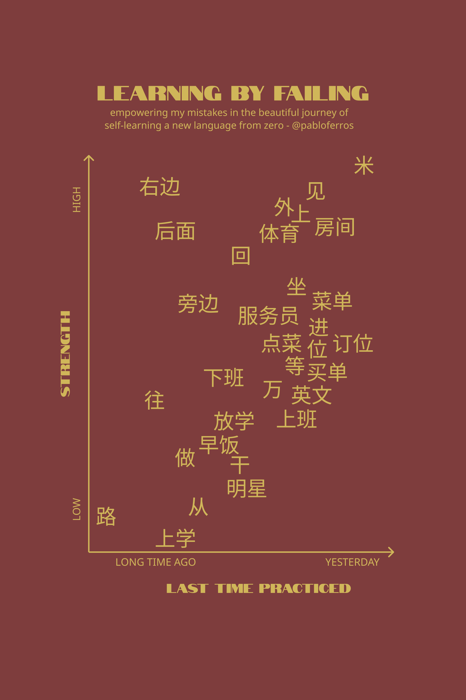
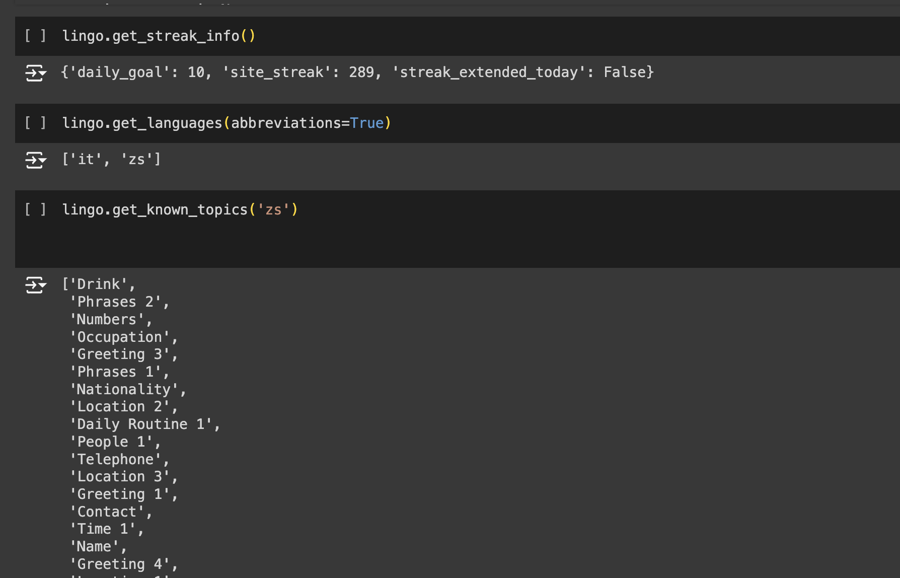

# DuolingoChinese 📚🇨🇳
I tracked my Chinese learning journey in Duolingo with the API and some exploratory analysis

This repository offers an in-depth look at my Duolingo Chinese learning progress, leveraging the 'duolingo' library in Python. Through detailed analysis, I've explored words by topics, revealing insights into my learning patterns.




Here, you'll find information on practice session frequencies, timestamps of last interactions with specific words, and proficiency ratings assigned by Duolingo. Join me in exploring the nuances of my language learning journey as I aim to understand my progress and proficiency, one word at a time.

```
pip install duolingo-api

import duolingo
lingo = duolingo.Duolingo('your_username', 'your_password')
```


